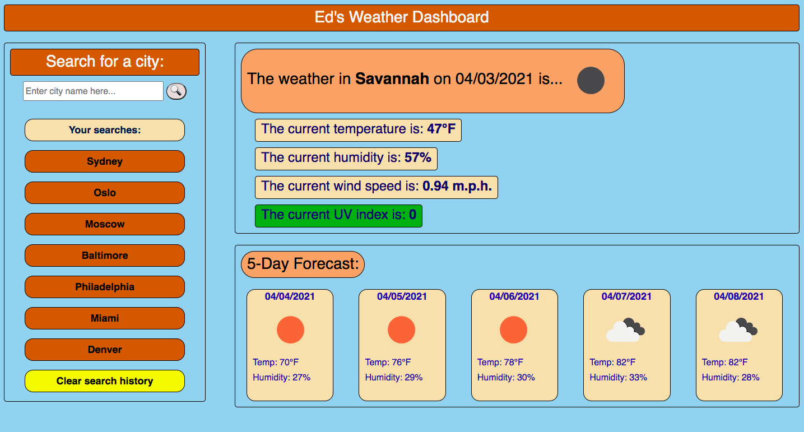
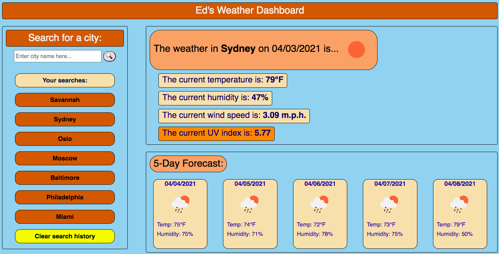
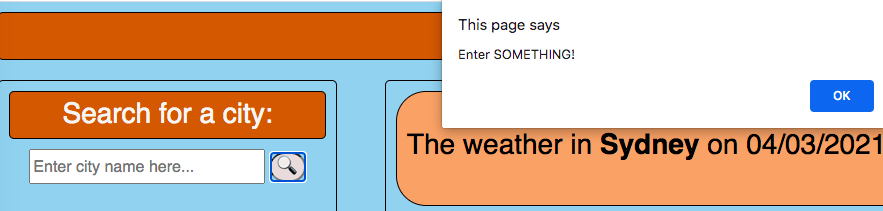
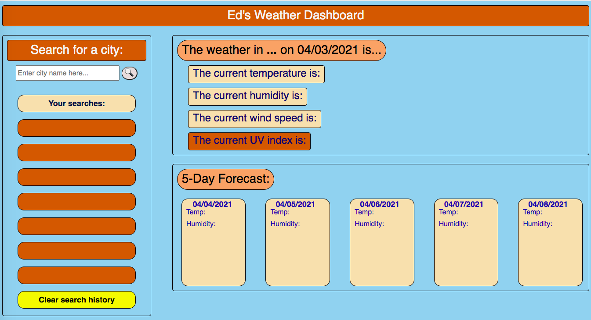

# WeatherDashboard
 
## HW 6 Description
This webpage was created so a user could search for the weather by entering a city name. They will be presented with the current temp, humidity, wind speed, and uv index; as well as the weather for the next 5 days. 
 
## Table of Contents
- [Installation](#installation)
- [Criteria Checks](#criteria)
- [Usage and Coding](#Usage/coding)
- [Screenshots](#screenshots)
- [Credits](#credits)
- [License](#license)
## Installation
Clone or download this repository on GitHub then open "edoliva.github.io/WeatherDashboard" in a browser.  
## Criteria
- The user must enter the name of a city to search. As more cities are searched, the names are rendered in the "Your searches" section. The previous 7 searches will be rendered.
- If the user enters an invalid city name then no weather data will be displayed.
- Previous searches can be re-searched by clicking on their name on the left column. 
## Usage/coding:
- This HTML, CSS and JS were written to allow for a clean user experience. The general logic is as follows:
   - The left cloumn displays an input that saves the city names to local storage in an array.
   - The API URL is updated to include the most recently entered city name along with the key. The key remains the same each time, the city name is dynamic and will be the most recent user city entry. 
     - Blank searches will receive an error. Invalid entries will yield no redult.
   - The url will link to an array of objects that include the cities weather data - this will be current weather as well as the next 5 days. 
   - Variables are created that will reference specific items in the array. These items are then rendered by using document.querySelector. 
   - The weather icons are displayed by pulling the "icons" code that updates a url. This url is hosted by openweathermap and represents a specific icon.
   - When a user clicks on their saved searches it acts as though this is a new search, and enters that city name as the most recent city in the local storage array.
   - The user can click on the "Clear search history" button and it will clear the locally saved cities, then refresh the page. 
   - The UV index box is updated based on the EPA's UV color scale. The color of the box - 0-2(green), 3-5(yellow), 6-7(orange), 8-10(red), and 11-above(purple) - changes based on the city location.   
 
## Screenshots

Full screen example: Savannah. Note the nightime icon, as this search is occuring at night. Thought the next 5 days represent the next 5 daytime temps and humidity.
-

-
Full screen example: Sydney. Done by clicking on a saved search button. Note the higher UV index updates the box color.   
-

-
Blank search error
-

-
Clear search history
-

-
 
## Credits
Shoutout to our instructor Anthony and TA Tom! As well as everyone at Trilogy Education for making the content and grading our assignments.
 
## License
© 2021 Edmond Oliva.
Confidential and Proprietary. All Rights Reserved.
---
